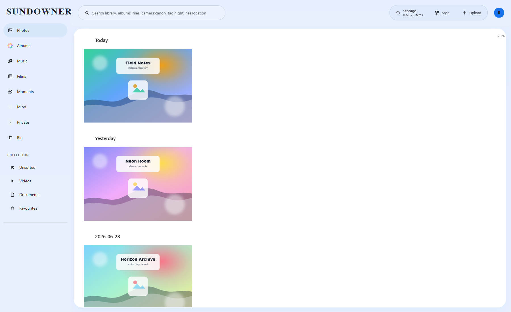
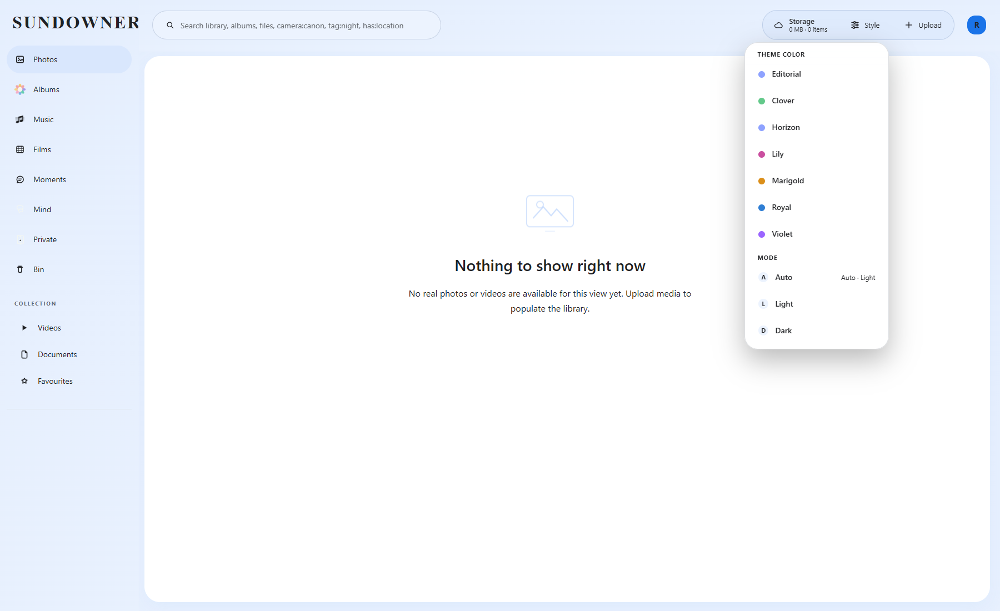
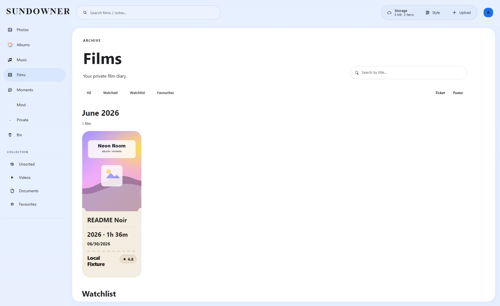
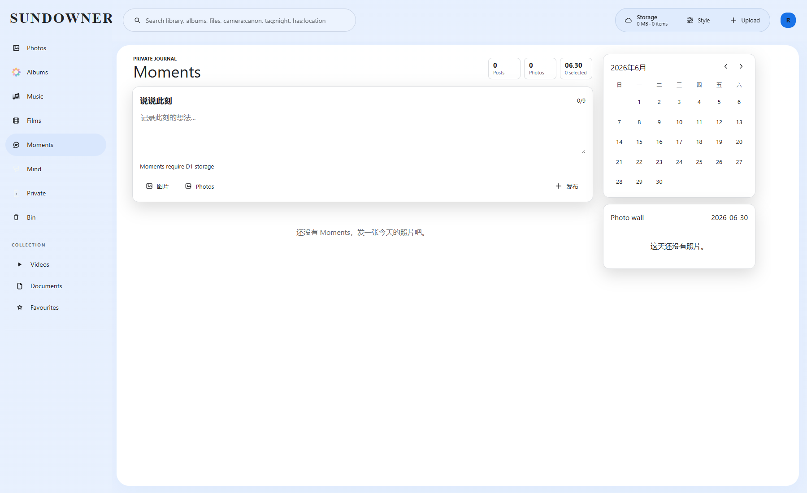

<div align="center">
  

  <h1>SUNDOWNER</h1>

  <p>
    <strong>Private media, searchable metadata, recoverable imports, and storage channels under one bright control surface.</strong>
  </p>

  <p>
    Cloudflare Pages Functions | D1/KV Hybrid | Telegram Sync | R2/S3/Discord/Hugging Face
  </p>

  <p>
    <a href="README_zh.md">简体中文</a> |
    <a href="#open-source-origin">Open-source origin</a> |
    <a href="#experience">Experience</a> |
    <a href="#screenshots">Screenshots</a> |
    <a href="#storage-model">Storage Model</a> |
    <a href="#quick-start">Quick Start</a> |
    <a href="#operator-notes">Operator Notes</a>
  </p>
</div>

## Open-source Origin

> **SUNDOWNER is an independent, long-term open-source second development based on [MarSeventh/CloudFlare-ImgBed](https://github.com/MarSeventh/CloudFlare-ImgBed).** That upstream project is itself a remake of [cf-pages/Telegraph-Image](https://github.com/cf-pages/Telegraph-Image). SUNDOWNER retains the upstream MIT license and attribution, but is maintained independently and is not an official upstream release.

This is more than a renamed deployment copy. The public codebase has expanded the original image-bed foundation into a private media library with D1/KV hybrid metadata, multi-channel storage, Telegram recovery and migration tooling, WebDAV, security hardening, and a dedicated dashboard. Source code, documentation, deployment scripts, regression tests, and issue tracking remain open in this repository.

[Source code](https://github.com/Aschenbath/SUNDOWNER) | [Issues](https://github.com/Aschenbath/SUNDOWNER/issues) | [Pull requests](https://github.com/Aschenbath/SUNDOWNER/pulls) | [MIT License](LICENSE)

## Experience

Building on that image-bed foundation, SUNDOWNER has grown into a private media cockpit: upload, catalog, search, serve, recover, and migrate media across storage backends from one admin surface.

| Surface | What it is for |
| --- | --- |
| Library cockpit | Browse photos, videos, audio, documents, albums, films, moments, and notes from one admin UI. |
| Upload routing | Send files to Telegram, Discord, Cloudflare R2, S3-compatible storage, or Hugging Face channels. |
| Recovery tooling | Repair Telegram imports, recover `file_id` values, scan orphan records, and migrate KV metadata into D1. |
| Operations | Manage auth, API tokens, WebDAV, public browsing, random APIs, quotas, cache behavior, and channel config. |

## Screenshots

The screenshots below are captured from this repository running locally with Wrangler Pages dev, D1/KV/R2 bindings, temporary README-only credentials, and privacy-safe fixture media generated by `npm run capture:readme`. They are not old upstream screenshots and not user-provided images.

| Library with local fixture media | Theme/style controls |
| --- | --- |
|  |  |

| Films | Moments |
| --- | --- |
|  |  |

On Windows, refresh the captures with one command:

```powershell
npm run capture:readme:local
```

The wrapper starts Wrangler with an isolated local persistence directory, runs the screenshot capture script, and stops the local server when it finishes.

If you need to run the steps manually, start the local app first:

```bash
npx wrangler pages dev ./ --kv img_url --d1 img_d1 --r2 img_r2 \
  --binding BASIC_USER=readme-admin \
  --binding BASIC_PASS=readme-password \
  --binding AUTH_CODE=readme-upload-code \
  --ip 127.0.0.1 --port 8787 \
  --persist-to D:/Codex/tmp_toDel/_sundowner-readme-data
```

Then, in another terminal, run:

```bash
npm run capture:readme
```

## What Makes This Fork Different

- D1 is the preferred metadata/query path, so normal library listing and search do not depend on expensive KV `list()` scans.
- Hybrid mode keeps compatibility with KV-backed deployments while moving queryable metadata into SQL.
- Telegram sync is treated as a first-class import pipeline, including the `file_id` vs `file_unique_id` recovery problem.
- Sensitive channel credentials are kept out of per-file metadata by design.
- The frontend is evolving from upload panel to media library: richer search, albums, films, moments, notes, and file management live together.
- Security hardening covers constant-time comparisons, fail-closed config handling, SSRF host allowlists, direct-file access checks, token response shaping, proxy header stripping, and generic 5xx responses.

### Photo loading and recovery

- Previously, Telegram JPEG/PNG tiles treated the stored thumbnail as a blur placeholder and automatically downloaded every original. Tiles now keep the same-file `/file/...?preview=1` thumbnail as their final grid image, including items restored from the browser's older media cache. Opening a photo still progressively loads its original (and retains adjacent-photo prefetch). This saves grid bandwidth at the cost of thumbnail-level detail until preview is opened; files without stored thumbnails and HEIC/HEIF decoding retain their existing paths.
- Telegram `getFile` failures remain negatively cached for 60 seconds to suppress repeated automatic calls. Previously, clicking retry hit that same failure cache. Bounded manual `retry=1..3` requests now bypass only negative file-path entries; positive thumbnail/path caches, request coalescing and access checks remain in effect. This also applies to original/embedded-preview fallback reads.
- Discarded upstream download bodies are cancelled before retrying or replacing a 404 response, so failed streams no longer occupy connections. The existing 250/750 ms backoff and attempt limit are unchanged.
- Failed photos used to retain only their error label across grid rerenders, restarting downloads and resetting per-element retry counts. Failed tiles now render without a network `src`; canonical/original sources and the three-attempt manual budget survive viewport changes, selection and virtualization for the page session. Disconnected nodes cannot overwrite current state. A successful load clears the failure/budget; a full page reload starts a new budget. After exhaustion, clicking the tile no longer bypasses the cap through the lightbox. Selection controls remain usable by mouse and keyboard.
- Regression coverage: `photoLoadingPipeline`, `photoRetryPersistence`, `telegramFilePathCache`, `fileRoutePreviewCache`, `fileToolsRetry`, `previewActions` and `entryLoader` tests. An isolated 48-photo browser fixture verifies 320/390/1440/1920 px layouts in both themes, grid requests without originals, full-resolution preview, no additional failed-photo requests during rerenders, persistent retry exhaustion and manual recovery. This is not a production-network benchmark; upstream availability, missing Telegram IDs, the file-route rate limit and Docker's no-op edge-cache shim remain separate operational constraints.

- Source changes now clear the retry budget together with load/failure state, and removed files discard their retry records. Previously, repaired files could inherit an exhausted budget; unchanged files still keep the three-attempt cap across rerenders. HEIC client-side fallback now forwards the bounded manual attempt to the original download instead of reusing its negative cache. Decode jobs coalesce per request/attempt while successful decoded output remains cached under the canonical source, avoiding repeat decoding after layout changes.
- Single-file and batch tag updates now use the shared `functions/utils/fileRouteUrl.js` helper to encode each file-ID segment before cache invalidation. Previously, `?`, `#`, `%`, spaces and `&` in names could target the wrong cache URL. Stored IDs and database keys are unchanged. Coverage includes the complete Mocha suite plus dedicated source-reset, HEIC request/coalescing and batch-tag URL tests; mocked downloads do not measure real upstream availability or codec performance.

- Preview entry also respects the persistent failure state while a manual retry is in flight. Previously, a quick second activation could open the original after the first click temporarily removed the error class; repeated activation now waits for that attempt instead of bypassing its request budget. This is covered by a dedicated regression and an isolated delayed-response browser check.

## Storage Model

Cloudflare binding names are part of the project contract:

| Binding | Type | Purpose |
| --- | --- | --- |
| `img_url` | KV namespace | Legacy metadata, settings, index chunks, and fallback state |
| `img_d1` | D1 database | Preferred metadata, settings, and query database |
| `img_r2` | R2 bucket | Cloudflare R2 file channel |

When both `img_url` and `img_d1` exist, `functions/utils/databaseAdapter.js` runs in Hybrid mode. D1 handles queryable metadata; KV remains available for compatibility and selected mirrored state.

Do not store tokens in file metadata. Non-`manage@` keys are sanitized before write, stripping sensitive fields such as Telegram, Discord, S3, and Hugging Face credentials. Store channel credentials in upload config (`manage@sysConfig@upload`) or environment variables, then attach files through `ChannelName`.

## Architecture

```text
.
+-- functions/                 Cloudflare Pages Functions routes
|   +-- api/                   public and management APIs
|   +-- file/                  direct media serving
|   +-- upload/                upload and chunk-merge flows
|   +-- dav/                   WebDAV endpoint
|   +-- utils/                 database, auth, storage, sync, cache helpers
+-- js/media-library/          admin media-library frontend modules
+-- css/                       compiled and override styles
+-- database/                  local SQLite/D1 bootstrap SQL and migrations
+-- server/                    local Node runtime that emulates Pages Functions
+-- test/                      Mocha regression tests
+-- static/brand/              SUNDOWNER brand artwork
+-- static/icons/              favicon and PWA icon assets
+-- static/fonts/              web font assets
+-- static/legacy/img/         legacy bundle image assets
+-- static/readme/             README screenshots
+-- static/tools/              standalone operator tools
```

Key files:

| File | Role |
| --- | --- |
| `functions/utils/databaseAdapter.js` | Selects KV, D1, or Hybrid mode and protects metadata writes. |
| `functions/utils/d1Database.js` | Owns D1 schema repair, indexed file queries, and settings operations. |
| `functions/utils/indexManager.js` | Manages legacy chunked indexes and index operation compatibility. |
| `functions/utils/mediaSecurity.js` | Resolves channel credentials and strips sensitive file metadata. |
| `functions/api/manage/sysConfig/upload.js` | Stores upload-channel configuration. |
| `functions/api/manage/migrate/kv-to-d1.js` | Migrates legacy KV metadata/settings into D1. |
| `scripts/capture-readme-screenshots.mjs` | Seeds neutral local demo data and captures the current README screenshots. |
| `scripts/capture-readme-screenshots.ps1` | Starts an isolated local Wrangler session, runs the screenshot capture, and cleans up the server. |

## Quick Start

Requirements:

- Node.js 22.x
- npm
- Cloudflare Wrangler for Pages local development
- Cloudflare resources for deployed use: KV `img_url`, D1 `img_d1`, and optionally R2 `img_r2`

Install dependencies:

```bash
npm install
```

Install function dependencies for Cloudflare Pages builds:

```bash
npm run install
```

Run the Cloudflare Pages development server:

```bash
npm start
```

`npm start` writes Wrangler local state under `./.local/data`, keeping generated development data out of the repository root.

Wrangler serves the app at:

```text
http://localhost:8787
```

Run the local Node/Docker-compatible runtime:

```bash
npm run start:docker
```

Or run the container:

```bash
docker compose up -d
```

Docker maps the service to:

```text
http://localhost:7658
```

## Deployment

This repo does not depend on a checked-in `wrangler.toml`. Configure bindings in Cloudflare Pages project settings or your deployment pipeline.

Recommended production bindings:

- KV namespace: `img_url`
- D1 database: `img_d1`
- R2 bucket: `img_r2` when using Cloudflare R2

Common optional settings:

- `TG_BOT_TOKEN`: fallback Telegram bot token when upload config does not provide one.
- `FETCH_RES_ALLOWED_HOSTS`: explicit host allowlist for `/api/fetchRes`; leave unset to keep that proxy disabled.
- `ALLOW_BEARERLESS_FILE_ACCESS` / `access.allowBearerlessFileAccess`: legacy compatibility opt-out for `/file/*`; leave unset or `false` so no-`Referer` direct file requests require `authCode`.
- Admin/user auth, upload channels, WebDAV, public browsing, random API, API tokens, quotas, and page options are managed through system config APIs/UI and stored under `manage@sysConfig@...`.

After binding D1 to an existing KV-backed deployment, migrate metadata in batches:

```text
POST /api/manage/migrate/kv-to-d1
```

The migration endpoint requires both `img_url` and `img_d1`. It skips internal chunk/index keys, can include settings, and records migration state under `manage@sysConfig@kvToD1Migration`.

## Testing

Run the Mocha suite:

```bash
npm test
```

Run integration-style tests with the local dev server:

```bash
npm run ci-test
```

Run Docker-style local server tests:

```bash
npm run ci-test:docker
```

Run the public documentation guard after README, screenshot, or branding changes:

```bash
npm run test:docs
```

For quick syntax checks on touched files:

```bash
node --check scripts/capture-readme-screenshots.mjs
npm run test:docs
node --check functions/utils/databaseAdapter.js
node --check js/media-library/app.js
```

Some local environments can fail the full suite because the native `better-sqlite3` binding is unavailable for the active Node runtime. Treat that as an environment baseline only after focused tests and failure titles confirm there are no new regressions.

## Operator Notes

- Avoid new code paths that depend on broad KV `list()` scans. Prefer D1 SQL queries or chunk-based `kv.get()` reads.
- Telegram `file_id` and `file_unique_id` are not interchangeable. Only the real `file_id` can be used with Telegram `getFile`.
- Keep credentials in upload config or environment variables, not in file metadata.
- `/file/*` direct access is not bearerless by default: use same-origin/allowed-domain `Referer`, valid `authCode`, or an explicit legacy opt-out.
- If a route proxies third-party media, do not forward inbound `Authorization`, `Cookie`, or `authCode` headers.
- Keep cache-busted frontend module versions in `index.html`, `js/entry-loader.js`, and related tests synchronized.
- Refresh `static/readme/current-*.png` from a local run before a public-facing release.

## License

This project keeps the upstream MIT license. See [LICENSE](LICENSE).
