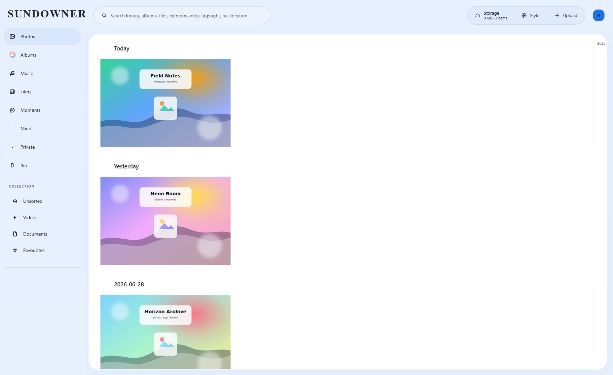
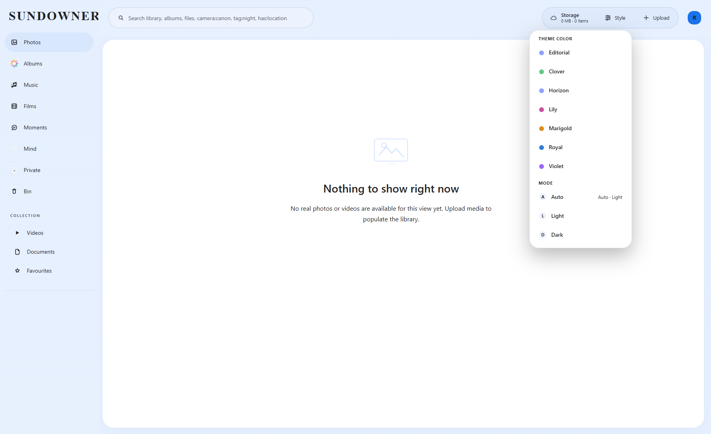
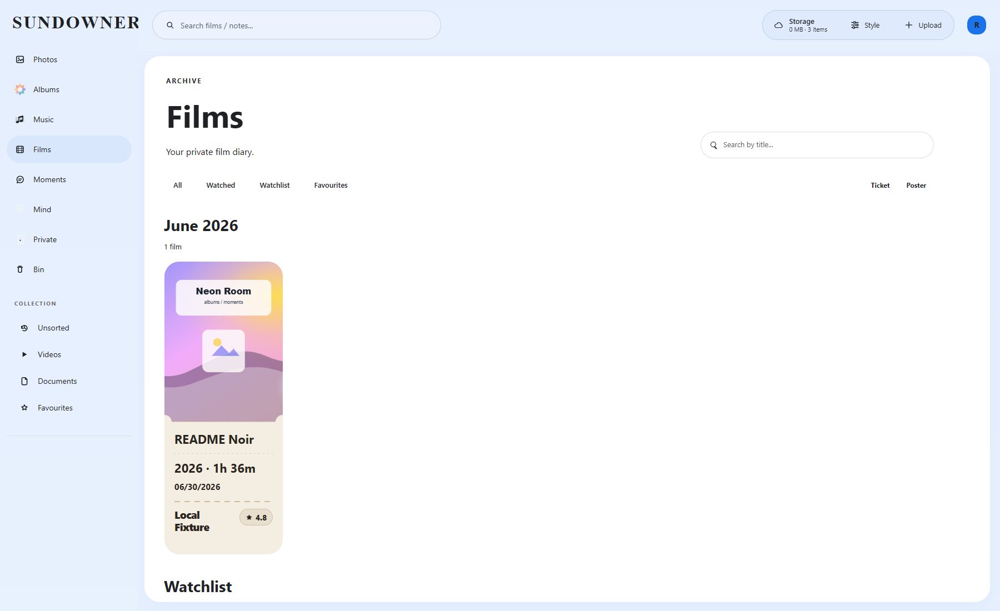
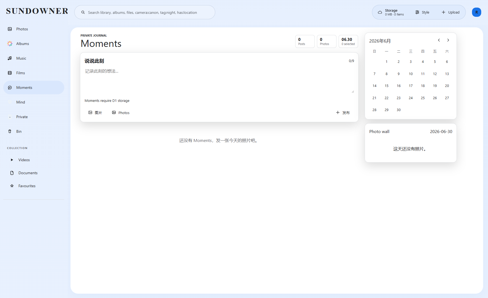

<div align="center">
  

  <h1>SUNDOWNER</h1>

  <p>
    <strong>跑在 Cloudflare 上的私有媒体库：上传、整理、搜索、直链、迁移和恢复，都收进一个明亮的控制台。</strong>
  </p>

  <p>
    Cloudflare Pages Functions | D1/KV Hybrid | Telegram Sync | R2/S3/Discord/Hugging Face
  </p>

  <p>
    <a href="README.md">English</a> |
    <a href="#产品体验">产品体验</a> |
    <a href="#当前截图">当前截图</a> |
    <a href="#存储模型">存储模型</a> |
    <a href="#快速开始">快速开始</a> |
    <a href="#运维提示">运维提示</a>
  </p>
</div>

## 产品体验

SUNDOWNER 最早来自图床项目，但这个 fork 已经更接近一个私有媒体驾驶舱。它不只是把文件传上去，而是把照片、视频、音频、文档、相册、影片、动态和笔记放在同一个管理界面里，方便检索、整理、访问、恢复和迁移。

| 模块 | 用途 |
| --- | --- |
| 媒体库控制台 | 在一个后台里浏览照片、视频、音频、文档、相册、影片、动态和笔记。 |
| 上传路由 | 将文件写入 Telegram、Discord、Cloudflare R2、S3 兼容存储或 Hugging Face。 |
| 恢复工具 | 修复 Telegram 导入记录，恢复真实 `file_id`，扫描孤儿文件，并把 KV 元数据迁移到 D1。 |
| 运维配置 | 管理鉴权、API token、WebDAV、公开浏览、随机 API、配额、缓存和通道配置。 |

## 当前截图

下面的截图来自本仓库本地运行的当前界面：Wrangler Pages dev + D1/KV/R2 binding + 临时 README 截图账号 + `npm run capture:readme` 生成的中性演示素材。它们不是旧上游截图，也不是用户提供的截图。

| 带本地演示素材的媒体库 | 主题与样式面板 |
| --- | --- |
|  |  |

| Films | Moments |
| --- | --- |
|  |  |

在 Windows 上，一条命令即可刷新截图：

```powershell
npm run capture:readme:local
```

这个包装脚本会用隔离的本地持久化目录启动 Wrangler，直接执行截图脚本，完成后停止本地服务。

如果需要手动分步执行，先启动本地项目：

```bash
npx wrangler pages dev ./ --kv img_url --d1 img_d1 --r2 img_r2 \
  --binding BASIC_USER=readme-admin \
  --binding BASIC_PASS=readme-password \
  --binding AUTH_CODE=readme-upload-code \
  --ip 127.0.0.1 --port 8787 \
  --persist-to D:/Codex/tmp_toDel/_sundowner-readme-data
```

然后在另一个终端运行：

```bash
npm run capture:readme
```

## 这个 Fork 的重点

- D1 是当前首选的元数据和查询路径，常规列表与搜索不再依赖昂贵的 KV `list()` 扫描。
- Hybrid 模式兼容旧 KV 部署，同时把可查询元数据迁移到 SQL。
- Telegram 同步被当作正式导入流水线处理，包括 `file_id` 与 `file_unique_id` 的恢复问题。
- 文件级 metadata 不保存敏感凭证，避免 token 扩散到普通文件记录。
- 前端已经从上传面板演进为媒体库：搜索、相册、影片、动态、笔记和文件管理在同一个界面中协作。
- 安全加固覆盖常量时间比较、配置失败 fail-closed、SSRF host allowlist、Referer 检查、token 响应脱敏、代理头剥离和统一 5xx 返回。

## 存储模型

Cloudflare 绑定名是项目约定的一部分：

| 绑定名 | 类型 | 用途 |
| --- | --- | --- |
| `img_url` | KV namespace | 旧版 metadata、设置、索引 chunk 和 fallback 状态 |
| `img_d1` | D1 database | 首选 metadata、设置和查询数据库 |
| `img_r2` | R2 bucket | Cloudflare R2 文件通道 |

当 `img_url` 和 `img_d1` 同时存在时，`functions/utils/databaseAdapter.js` 会运行在 Hybrid 模式。D1 负责可查询 metadata，KV 继续承担兼容层和部分镜像状态。

不要把 token 写进文件 metadata。所有非 `manage@` 前缀 key 在写入前都会被清洗，Telegram、Discord、S3、Hugging Face 等敏感字段会被剥离。正确做法是把通道凭证放进 upload config（`manage@sysConfig@upload`）或环境变量，再通过 `ChannelName` 关联文件和通道。

## 项目结构

```text
.
+-- functions/                 Cloudflare Pages Functions 路由
|   +-- api/                   公开 API 与管理 API
|   +-- file/                  文件直链访问
|   +-- upload/                上传与分片合并流程
|   +-- dav/                   WebDAV 端点
|   +-- utils/                 数据库、鉴权、存储、同步、缓存工具
+-- js/media-library/          管理端媒体库前端模块
+-- css/                       编译样式与覆盖样式
+-- database/                  本地 SQLite/D1 初始化 SQL 与迁移
+-- server/                    模拟 Pages Functions 的本地 Node runtime
+-- test/                      Mocha 回归测试
+-- static/brand/              SUNDOWNER 品牌图
+-- static/icons/              favicon 与 PWA 图标资源
+-- static/legacy/img/         旧 bundle 图片资源
+-- static/readme/             README 截图
+-- static/tools/              独立运维工具页
```

关键文件：

| 文件 | 作用 |
| --- | --- |
| `functions/utils/databaseAdapter.js` | 选择 KV、D1 或 Hybrid 模式，并保护 metadata 写入。 |
| `functions/utils/d1Database.js` | 负责 D1 schema 修复、文件查询和设置读写。 |
| `functions/utils/indexManager.js` | 管理旧版 chunk index 和索引操作兼容层。 |
| `functions/utils/mediaSecurity.js` | 解析通道凭证，并剥离敏感文件 metadata。 |
| `functions/api/manage/sysConfig/upload.js` | 存储上传通道配置。 |
| `functions/api/manage/migrate/kv-to-d1.js` | 将旧 KV metadata/settings 迁移到 D1。 |
| `scripts/capture-readme-screenshots.mjs` | 注入中性本地演示数据并抓取当前 README 截图。 |
| `scripts/capture-readme-screenshots.ps1` | 启动隔离的本地 Wrangler 会话，运行截图抓取，并在结束后清理服务。 |

## 快速开始

环境要求：

- Node.js 22.x
- npm
- Cloudflare Wrangler，用于 Pages 本地开发
- 生产部署需要 Cloudflare KV `img_url`、D1 `img_d1`，以及可选的 R2 `img_r2`

安装依赖：

```bash
npm install
```

安装 Cloudflare Pages Functions 构建依赖：

```bash
npm run install
```

启动 Cloudflare Pages 本地开发服务：

```bash
npm start
```

Wrangler 默认访问地址：

```text
http://localhost:8787
```

启动本地 Node/Docker 兼容 runtime：

```bash
npm run start:docker
```

或直接用 Docker：

```bash
docker compose up -d
```

Docker 映射地址：

```text
http://localhost:7658
```

## 部署

这个仓库不依赖提交到仓库里的 `wrangler.toml`。生产环境建议在 Cloudflare Pages 项目设置或部署流水线中配置绑定。

推荐生产绑定：

- KV namespace：`img_url`
- D1 database：`img_d1`
- R2 bucket：使用 Cloudflare R2 通道时配置 `img_r2`

常见可选配置：

- `TG_BOT_TOKEN`：当 upload config 中没有可用 Telegram token 时的兜底 bot token。
- `FETCH_RES_ALLOWED_HOSTS`：`/api/fetchRes` 的 host allowlist；不设置时该代理保持禁用。
- 管理员/用户鉴权、上传通道、WebDAV、公开浏览、随机 API、API token、配额和页面选项通过系统配置 API/UI 管理，并存放在 `manage@sysConfig@...` 下。

给已有 KV 部署绑定 D1 后，用迁移接口分批迁移 metadata：

```text
POST /api/manage/migrate/kv-to-d1
```

迁移接口要求同时存在 `img_url` 和 `img_d1`。它会跳过内部 chunk/index key，可选择迁移 settings，并把迁移状态记录到 `manage@sysConfig@kvToD1Migration`。

## 测试

运行 Mocha 测试：

```bash
npm test
```

带本地 dev server 的集成式测试：

```bash
npm run ci-test
```

Docker 风格本地 server 测试：

```bash
npm run ci-test:docker
```

修改 README、截图或公开品牌展示后，运行公开文档守门测试：

```bash
npm run test:docs
```

对改动文件做快速语法检查：

```bash
node --check scripts/capture-readme-screenshots.mjs
npm run test:docs
node --check functions/utils/databaseAdapter.js
node --check js/media-library/app.js
```

部分本地环境会因为当前 Node runtime 下缺少原生 `better-sqlite3` binding，导致完整测试套件失败。只有在 focused tests 与失败标题确认没有新增回归后，才把它视为环境基线。

## 运维提示

- 新代码尽量不要依赖大范围 KV `list()` 扫描，优先使用 D1 SQL 查询或基于 chunk 的 `kv.get()` 读取。
- Telegram `file_id` 和 `file_unique_id` 不能混用；只有真实 `file_id` 可以调用 Telegram `getFile` 下载。
- 凭证放在 upload config 或环境变量中，不要放进文件 metadata。
- 代理第三方媒体时，不要转发入站的 `Authorization`、`Cookie` 或 `authCode` header。
- 修改前端入口时，同步维护 `index.html`、`js/entry-loader.js` 和相关测试中的 cache-bust 版本。
- 公开发布前，用本地运行的当前界面刷新 `static/readme/current-*.png`，避免沿用旧上游界面图。

## 许可证

本项目保留上游 MIT License。详见 [LICENSE](LICENSE)。
